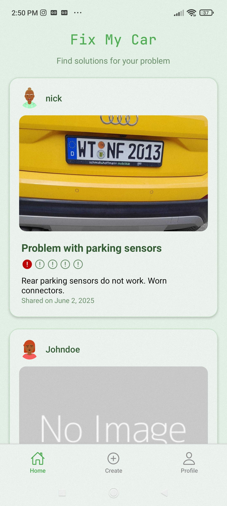
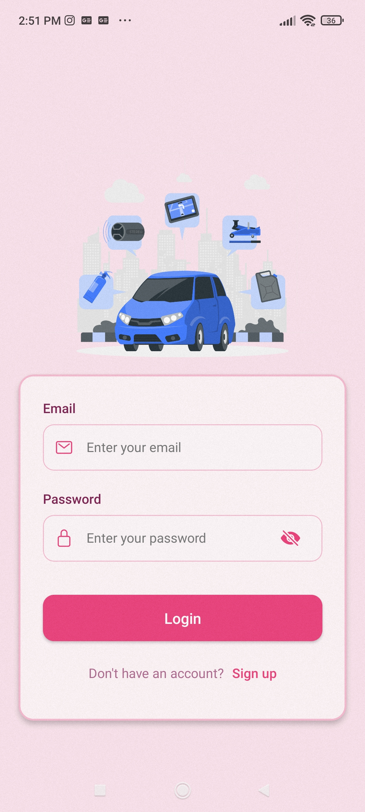
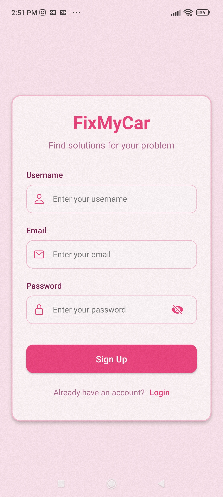
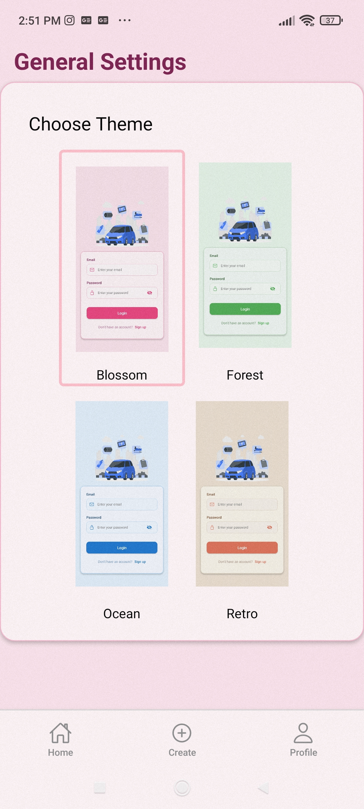

# 🚗 fixMyCar - React Native Social App for Car Troubleshooting

**fixMyCar** is a mobile application built with **React Native** that connects car owners facing issues with their vehicles. The app serves as a social platform where users can share their car problems, view solutions posted by others, and receive real-time notifications when relevant issues are posted.

The mobile frontend communicates with a Node.js backend and uses **JWT authentication** and **Expo push notifications** to deliver a seamless user experience.

---

## 💡 Motivation & Inspiration

Car issues are a common frustration for many people, and often the best help comes from someone who's been through the same problem. The idea behind **fixMyCar** is to create a social network specifically for car owners — a place where users can:
- Post car issues they've encountered,
- Share how they solved them,
- Learn from others who experienced the same problems,
- Receive helpful notifications when new, related posts are made.

Whether it's a mysterious engine light or an odd sound from the wheels, **fixMyCar** aims to build a helpful community of shared experiences and solutions.

---

## 🎯 App Functionalities

| Feature | Description |
|--------|-------------|
| 🔐 Register & Login | Users can create an account and sign in |
| 🔑 JWT Auth | Secure API calls using JSON Web Tokens |
| 🏠 View Posts | Browse a feed of car-related posts by all users |
| ✍️ Create Post | Share a car issue or solution, including title and description |
| 🧾 My Profile | View your profile and see all your posts |
| 🔔 Notifications | Receive push notifications when someone adds a new post |
| 📱 Save Push Token | Automatically saves your device’s Expo push token to receive alerts |
| 🚗 Community Focus | Designed specifically around real car problems and user-generated solutions |
| 🎨 App Themes | Four different colour schemes available to choose |

---

## 🛠️ Tech Stack

| Technology | Role |
|------------|------|
| React Native (Expo) | Mobile development |
| React Navigation | Navigation and routing |
| AsyncStorage | Local token storage |
| Expo Notifications | Push notification handling |
| Firebase (via Expo) | Underlying push infrastructure |
| JWT | Secure authentication |

---

## 📁 Project Structure
fixMyCar-App/
│
├── app/
│ ├── (auth)/ # Tabs group for register and login screens
│ ├── (tabs)/ # Home, create post, post details, profile screens
│ 
│
├── assets/ # Images, icons
├── lib/ # Helper functions
├── constants/ # Color schemes, api
├── context/ # Context providers
└── app.json # Expo config

## 📸 Screenshots

### 🏠 Home Screen

### 🔐 Login Screen

### 🔐 Register Screen

### ⚙️ Create Post Screen

### 🎨 Change Theme Screen

## 🧪 Future Improvements
- Add like and comment functionalities for posts
- Filtering/searching by car model or issue type
- Issue categorization (engine, suspension, etc.)

## 👨‍💻 Author
Made with ❤️ by Nikola Andric

This app is part of a learning and development process and demonstrates skills in React Native, RESTful APIs, JWT auth, NOde JS, little bit of MongoDB and real-world mobile app architecture. 
